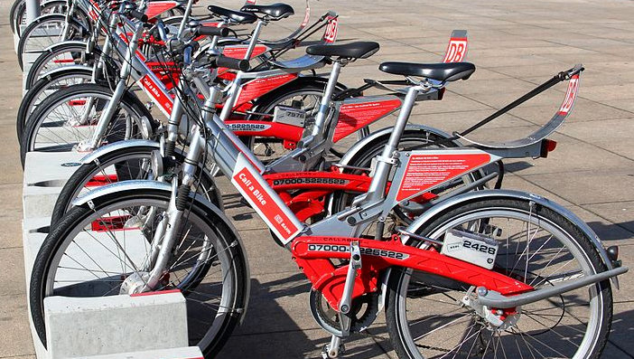

# Analysis of Bike Sharing Data

   
  Photo by <a href="https://commons.wikimedia.org/wiki/File:Call-a-Bike_Berlin.JPG">Rudolf Simon</a> on Wikimedia 

## About

*Deutsche Bahn* provides reporting data of its bike sharing service "Call a Bike" under an open license (Creative Commons Attribution 4.0 International CC BY 4.0.).

The dataset covers the years 2016/2017 and is available at [https://data.deutschebahn.com/dataset/data-call-a-bike](https://data.deutschebahn.com/dataset/data-call-a-bike)

## Objectives

### Explorative Data Analysis

Figure out answers for questions like

* How many bikes are being used?
* How many customers use the bikes (regularly)?
* How long do customers rent the bikes?
* How far do they travel?
* What are typical rental times?
* What are typical hub locations?
* How often are bikes relocated to satisfy increased demand?
